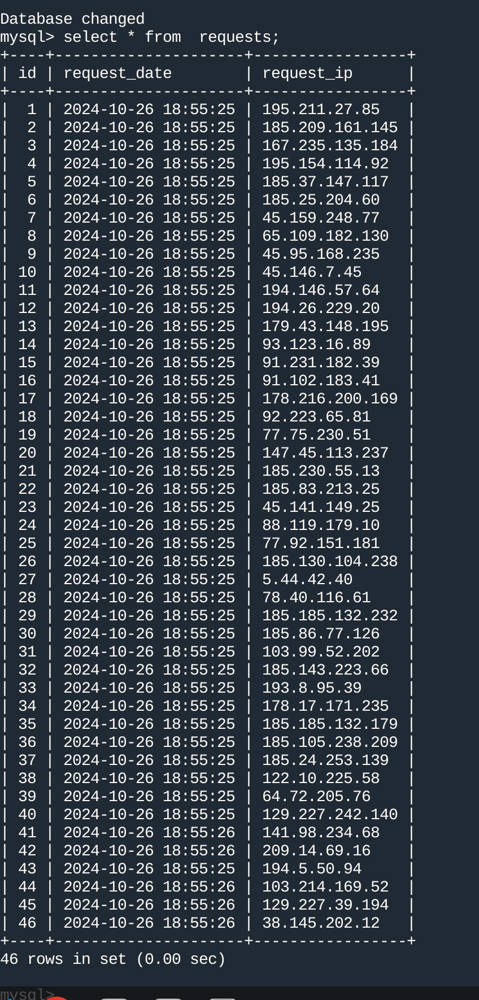

### Задача 1

#### 1.1

https://github.com/a148ru/shvirtd-example-python

#### 1.2

```docker
FROM python:3.9-slim
WORKDIR /app
COPY requirements.txt .
RUN pip install -r requirements.txt
COPY . .
CMD ["python3","main.py"]
EXPOSE 5000
```


#### 1.3*

#### 1.4*

### Задача 2*

[vulnerabilities.csv](vulnerabilities.csv)


### Задача 3

#### 1.[1-2]


#### 1.[3-4]


### Задача 4
main.py


not_tested_main.py


### Задача 5*


### Задача 6

#### 6


копировать не стал,оно у меня уже есть:
```bash
$ whereis terraform 
terraform: /usr/local/bin/terraform
$ terraform -v
Terraform v1.9.8
on linux_amd64
$ 
```
#### 6.1


#### 6.2**

### Задача 7***